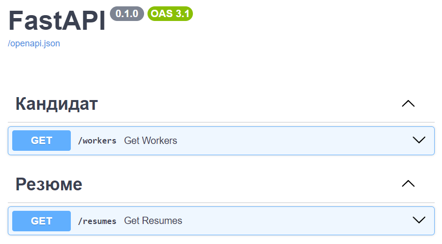
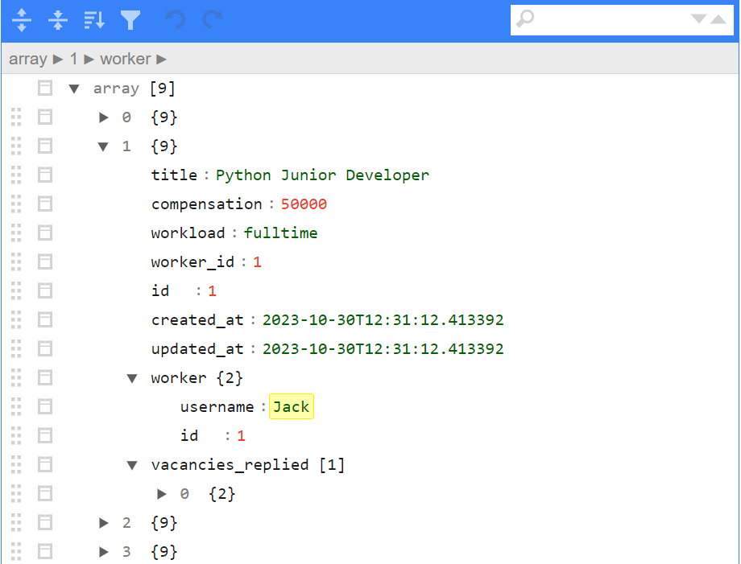

# Курс по SQLAlchemy от Артёма Шумейко
Курс покрывает все основные темы SQLAlchemy: Core, ORM, relationship, Alembic, конвертация ответов Алхимии в DTO.

### [Ссылка на YouTube курс](https://www.youtube.com/playlist?list=PLeLN0qH0-mCXARD_K-USF2wHctxzEVp40)

### FastAPI  
 

### Интерактивный просмотр JSON в браузере  

## Список уроков
1. [Плюсы ORM и Алхимии](https://youtu.be/hYuGRgVXGwU)
2. [Подключение к БД, сырые SQL запросы через engine](https://youtu.be/vh19Mlot0NY)
3. [Создание таблиц и вставка данных через Core](https://youtu.be/FZRH42jkO6o)
4. [Session и первые шаги в ORM](https://youtu.be/t7ufjzWKVk4)
5. [Создание таблиц через классы при помощи Mapped и mapped_column](https://youtu.be/JxL2iu9vpr8)
6. [SELECT и UPDATE запросы через ORM и Core](https://youtu.be/A72VICB-fjw)